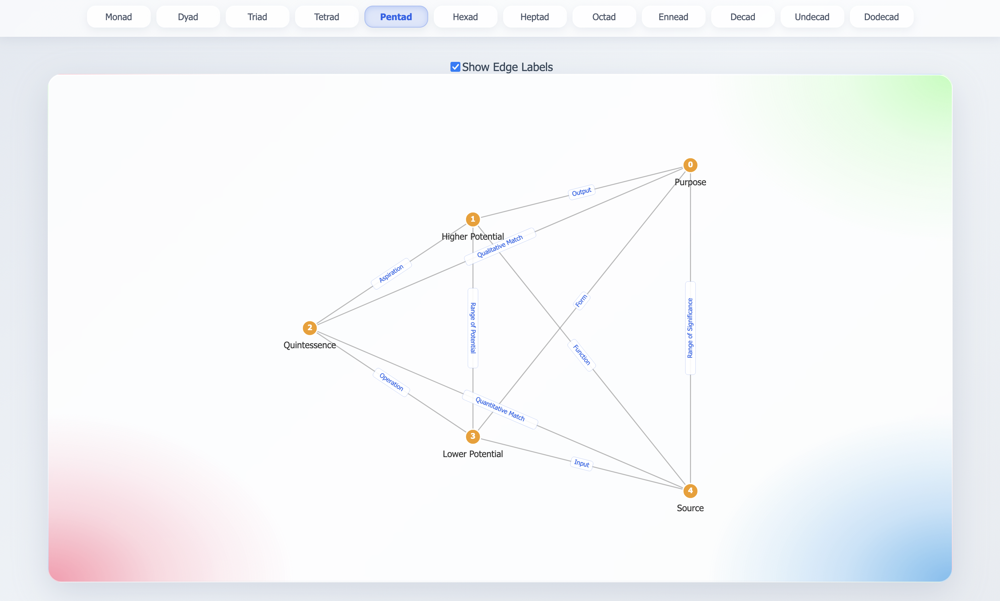
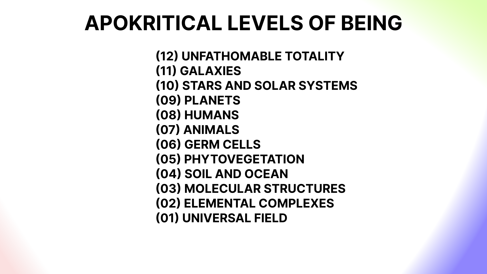
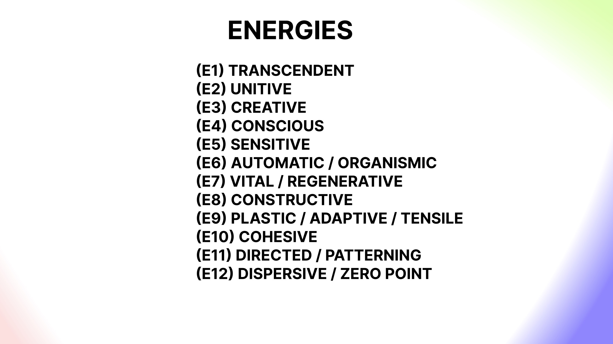
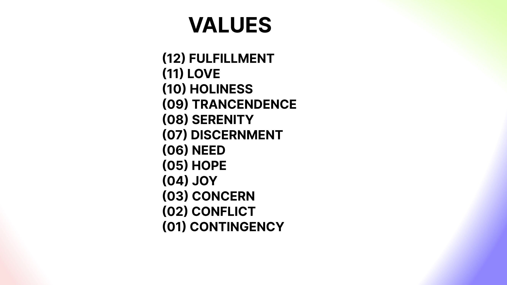
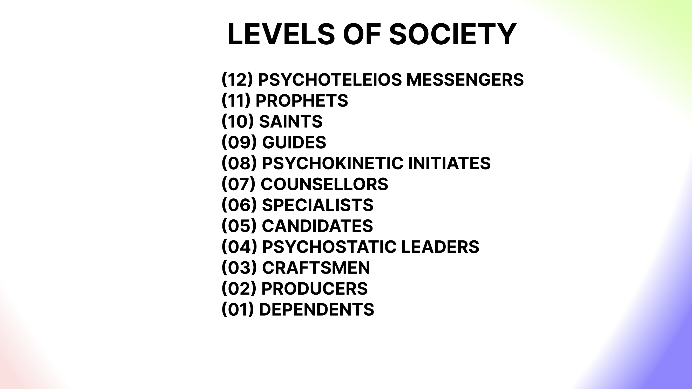

# systematics-v0.4

## Why

The field of arteficial intelligence is complex and solving any singular aspect is unlikely to be of much much value due to the non-linear and highly systemic nature of these systems. If we want safe performant systems then we need to work cross functionally across domains like interpretability, representation, and steerability.

## How

The inter-related nature of complex problems requires a relational approach, which in this case would be a functional linguistic ontology. Without going too deep into his work, Bennett offers a set of ontological lenses through a set of complete graphs which link the stable or invarient elements of a vocabulary together as a sort of ‘natural language metaphysics’ enabling such elements to be qualatively transformed according to the mathmatical principals of applied category theory. In other words, to over come issues with representation and interpretability, we are creating structured systems of transformation (morphisms and functors) which are applicable to both qualative and quantative domains, represented visually as complete graphs.

## What

In concrete terms, we are using number to articulate graphs that recursively contain other numeric systems. We start with a series of numbers - which have a particular isomorphic quality - and turn them into graphs. Each graph encapsulates further systems as indexed nodes; in other words each node in the graph is indexed with a number that in turn represents the embedding of another system in the form of a complete graph. For example the number four represents a tetradic K4 graph, which in turn contains nodes representing systems 1-4, so clicking the third node would open up a K3 triadic interface with a new set of terms.

## Horizon 1

The backend is intended to be extensible through category theory and bootstraps from three basic categories; topology, geometry, vocaublary - all of which are delivered over an API. These categories are complete in so far as they are enough to create an interface for autopoietic improvement; building out the grammars of each domain but they barely scratch the surface of the possibility space. In other words we can use the API to create an index, plot them as nodes on a graph (semantic positioning) and then represent the core vocabulary in line with these semantics.

## Horizon 2

This creates a functional foundation for further bootstrapping a more complete epistemology with hermenutic consistency based on the concrete significance of number. With this backbone in place we can then begin to add new categroical schemas to the system, be those maps of mathmatical spaces or Bennetts own work categorising science, philosophy, society and cosmology - which is obviously low hanging fruit:

## Horizon 3

With the ability to create, read, update and delete new schemas such as above - we can start to work on the more category theoretic elements to the system, namely the various transformation types between ‘objects’ like the indexes, coordinates or terms contained in the bootstrapping ‘categories’ of topology, geometry and vocabulary. These are perhaps not as fleshed out as the schemas developed by Bennett (above) so those might be considered more useful for analysing the relatioships.

The ability to add vocabulary and grammars in such a consistent way opens up many possible use cases in domains like interpretability, representation, steerability, and so on - for example, allowing us to probe latent space with different yet equivelent vocabularies in order to get a sense of an LLMs circuits, or we can link together knowledge graphs for the purposes of reasoning and explainability.

With regards to the category theoretic elements, with our bootstrapping structures in place as well as some initial well defined schemas, we can start looking at processes such as the morphisms between elements internal to a categroy, the functors between categories, or the homotopy types within and across categroies that articulate a sort of state model or hilbert space (note that each system is itself a kind of homotopy type).

For example we can examine the cross category equivelence mappings between index 1, coordinate 1 and term 1, which I believe is called the functorial semantics. Or we could look at morphism types between nodes in a given category such as isomorphisms, endomorphisms, homomorphisms and so on. We can look at linear transformations such as the fibrations illustrated below where the category of sub-animate existence ‘fibrates’ into a tetrad consisting of sub categories like ‘universal field/radiation, elemental complexes, molocular structures, soil and ocean’, and the same for animate and super animate levels of existence. Or we can work out the non-linear transforms between systems such as from a monad of humanity > dyad of man/woman > the triad of father/mother/child. (Note to self this is possibly a sort of qualative fourrier transform).
 

Building this prototype so that it is self consistent and ultimately correct by construction has already presented many challenges and bootstrapping issues, but horizon one has taken shape far enough to work on the API some more while adding new features.
Horizon omega

Assuming that we get as far as horizon three, we should by then have a pretty robust neurosymbolic system. At this point, we can start to add generative AI to the mix, which takes a more cybernetic approach. Assumedly the foundations will be codified to start augmenting the small language models (different categorical schemas) with machine learning techniques such as supervised learning, evolutionary strategies and reinforcement learning. This is of course where the project moves from function into being, which would naturally need to be related to a will or purpose - of which there are many possible candidates.

## Comments

The project is still barely a prototype but for now there are no blockers present and a relatively clear sequence of steps for it to reach its next stage. This has not always been the case and starting backend first led to a number of uncertainties. However having approached the API from the front end something has budged. We will no doubt need to go back and forth between front and backend as they both seem to influence eachother. Having the systems in the middle does seem to act as a sort of validation function for the more abstract work, begging questions of whats necessary and whats sufficient for the time being.

I’m very much looking forward to getting past the first development cycle where a kernal already exists and ML techniques come into play for the sake of augmenting human intelligence. This might go a number of ways but at the moment I’m dreaming of self describing protocols, autonomous cosmologies and holonic resource libraries that help us become better stewards.

We shall have to see what becomes.
